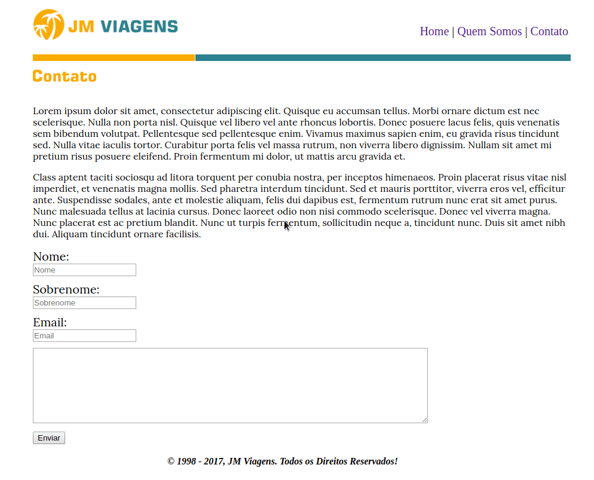

 # Conteúdo

O site é baseado no exercicio do modulo de HTML do curso [Curso completo de Desenvolvimento Web](https://www.udemy.com/curso-completo-do-desenvolvedor-web) da [Udemy](https://www.udemy.com).  
O exercicio constroi um site estático só com HTML, fiz algumas alterações e coloquei algumas tags do HTML5 além de separar o CSS.  

[Código do site](https://github.com/phewill/HTML/tree/master/Simple-site)  

### HOME  
  
--------------------------------------------------------

### QUEM SOMOS  
  
--------------------------------------------------------

### CONTATO  
  
--------------------------------------------------------

**Autor** - William garcia  
**Email** - william.rosa.garcia@gmail.com  
