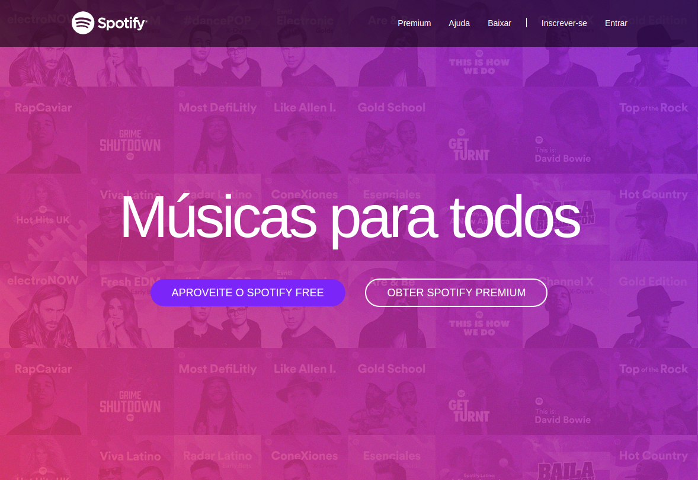
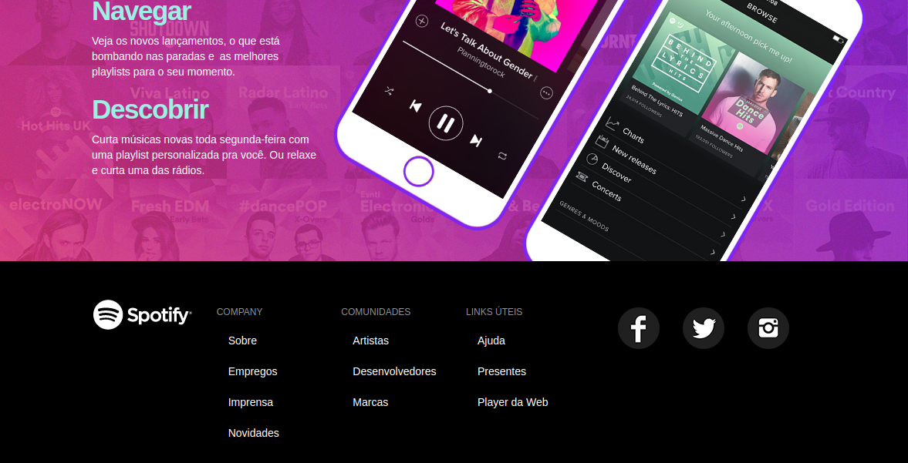

 # Conteúdo

O site é baseado no exercicio do modulo de Bootstrap do curso [Curso completo de Desenvolvimento Web](https://www.udemy.com/curso-completo-do-desenvolvedor-web) da [Udemy](https://www.udemy.com).  
O exercicio constroi um site praticamente identico com do Spotify, fiz algumas alterações que achei necessarias.  

[Código do site](https://github.com/phewill/HTML/tree/master/Spotify-Clone)  

### Site totalmente responsivo 

__

**Autor** - William garcia  
**Email** - william.rosa.garcia@gmail.com  
 
