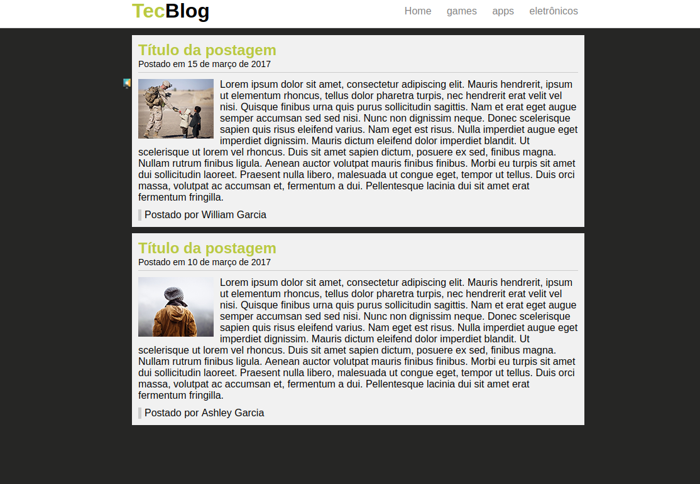

 # Conteúdo

O site é baseado no exercicio do modulo de HTML + CSS do curso [Curso completo de Desenvolvimento Web](https://www.udemy.com/curso-completo-do-desenvolvedor-web) da [Udemy](https://www.udemy.com).  
O objetivo é construir uma página com pequenos posts com HTML e CSS.  

[Código do site](https://github.com/phewill/Front-end-projects/tree/master/TecBlog)  

### HOME  
  
--------------------------------------------------------

### Mostrando o menu fixado na parte superior mesmo descendo no site. 
  
--------------------------------------------------------

**Autor** - William garcia  
**Email** - william.rosa.garcia@gmail.com  
